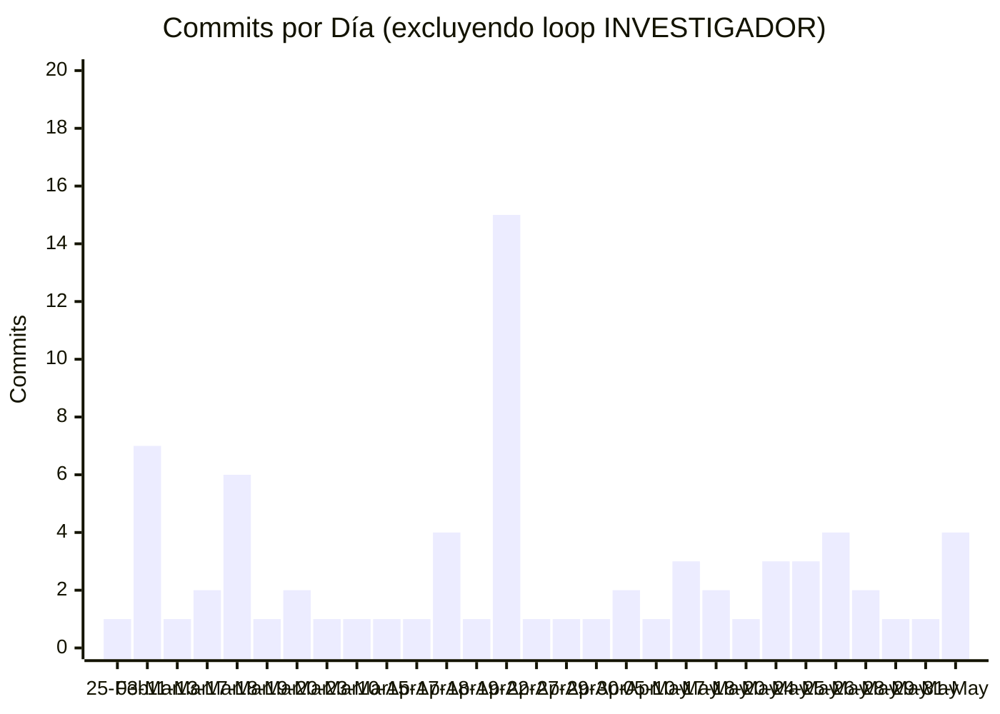
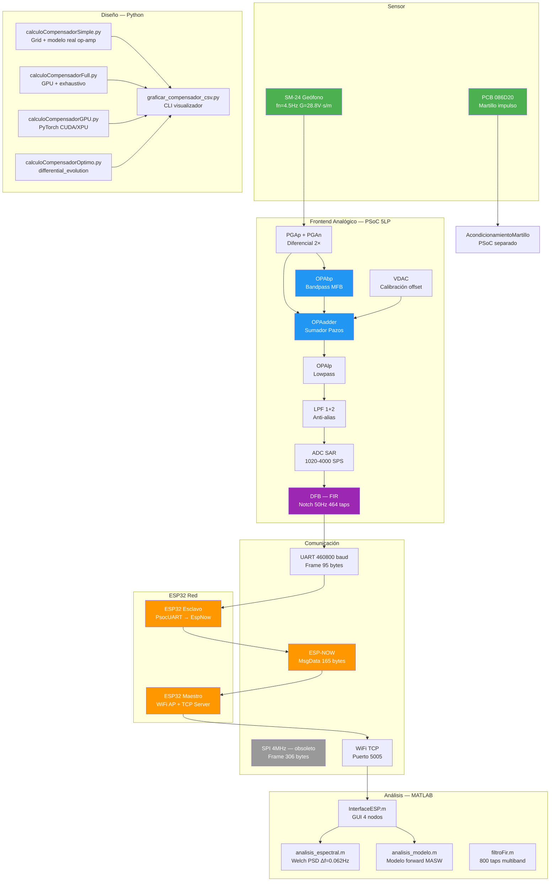
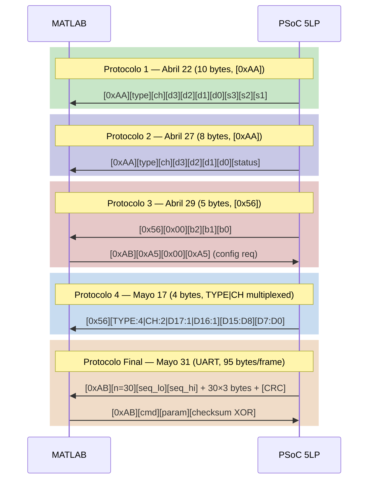
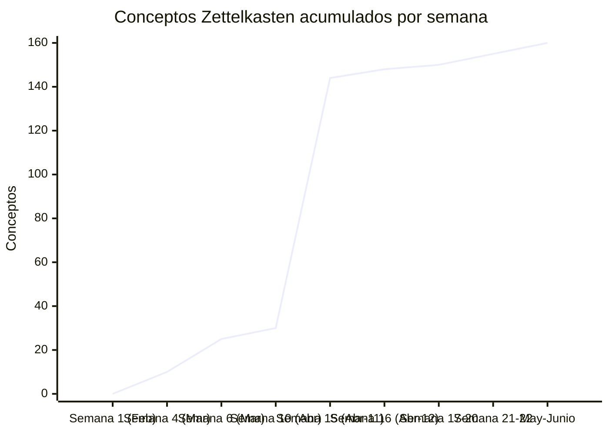
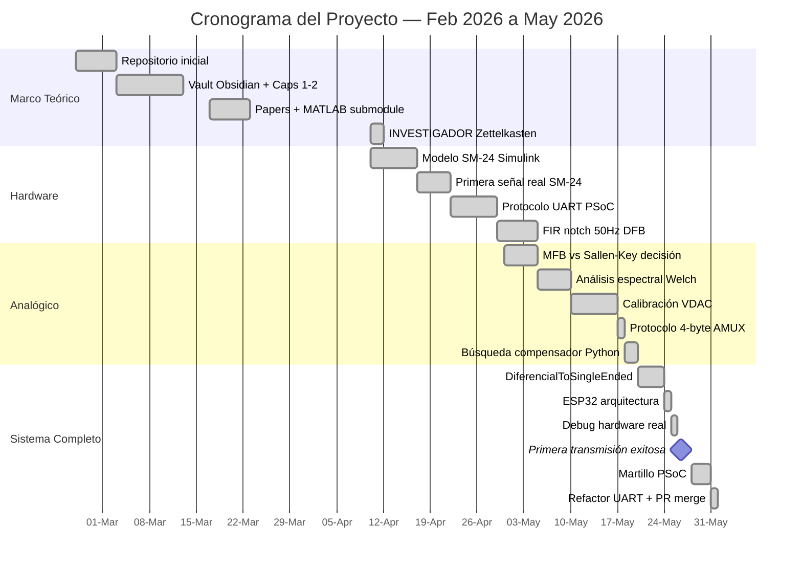

# Análisis del Proyecto — Tesis MASW Geofóno SM-24

*Generado automáticamente por el loop de bitácora — 4 de junio de 2026*

---

## Timeline de Etapas

```mermaid
timeline
    title Evolución del Proyecto — Feb 2026 → May 2026
    
    section Fundación
        Feb 25 : Commit inicial
                : Estructura básica del repositorio
    
    section Marco Teórico
        Mar 03 : Vault Obsidian arranca
                : Capítulo 1 resumen
                : Pruebas GitHub Actions
        Mar 11 : Foti — libros MASW en PDF
        Mar 13 : Chapter 2 pre-reordenamiento
        Mar 17 : MATLAB MASW submodule
                : Scripts Python calibración
                : XDDDD (primer commit épico)
        Mar 18 : Seguridad del vault
        Mar 19 : Caps 3/4/5 + Near-field Effect
        Mar 20 : Claudio revisión
        Mar 23 : BLABLABLA (expansion papers)
    
    section INVESTIGADOR IA
        Apr 10 : XDXDXD — arranque loop IA
        Apr 11 : 89 commits — 144 conceptos Zettelkasten
        Apr 12 : 25 commits — SEXTA FASE, 148 conceptos
    
    section Hardware Inicial
        Apr 15 : Assets reorganización
        Apr 17 : SM-24 modelo + primeras mediciones
        Apr 18 : Pivote analógico→FIR digital
        Apr 19 : Loop auto-mejora 15 commits
        Apr 22 : Primera señal real SM-24
        Apr 27 : Scope simplificado + compensadores
        Apr 29 : FIR notch 50Hz 464 taps + DFB
        Apr 30 : Pivot Sallen-Key → MFB
    
    section Sistema Digital
        May 05 : Análisis espectral Welch
        May 10 : Calibración VDAC offset
        May 17 : Protocolo 4-byte, validación op-amp
        May 18 : 4 motores búsqueda compensador
    
    section Sistema Completo
        May 20 : DiferencialToSingleEnded — cadena analógica completa
        May 24 : ESP32 inalámbrico multi-nodo
        May 25 : HELLO, START probe, CP210x
        May 26 : PRESTART — ¡FUNCIONA!
        May 28 : AcondicionamientoMartillo
        May 29 : Primer build martillo OK
        May 31 : Refactor UART, PR #2 merge
```

---

## Actividad por Día

---

## Mapa de Tecnologías

---

## Evolución del Protocolo PSoC

---

## Evolución del Vault Obsidian

**Hitos del vault:**
- `2026-03-03`: Primer Zettelkasten — Capítulo 1 MASW
- `2026-03-17`: Expansión teórica con submodule MATLAB MASW
- `2026-04-11`: INVESTIGADOR loop — 89 commits, 144 conceptos en un día
- `2026-04-12`: Cierre INVESTIGADOR — 148 conceptos totales, 4107 wikilinks
- `2026-05-31`: Estado final — ~160 conceptos, sistema completo documentado

---

## Mapa de Etapas del Proyecto

---

## Estadísticas Globales

| Métrica | Valor |
|---------|-------|
| **Período** | 25 Feb → 31 May 2026 (95 días) |
| **Total commits** | ~197 (incluyendo loop INVESTIGADOR) |
| **Días con trabajo** | 31 únicos |
| **Commits técnicos** | ~110 (excluyendo INVESTIGADOR) |
| **Proyectos PSoC** | 6 (`DiferencialConRrefs*`, `DiferencialToSingleEnded`, `DiferencialToSingleEnded_ESP`, `AcondicionamientoMartillo`) |
| **Scripts Python** | 7 (`calculoCompensador*`, `graficar_compensador_csv.py`, `analisis_espectral.py`) |
| **Scripts MATLAB** | ~12 (`geophone_scope*`, `analisis_*`, `filtroFir.m`, `compensador*.m`) |
| **Conceptos Zettelkasten** | ~160 |
| **Wikilinks** | >4107 |
| **Protocolos UART PSoC** | 5 evoluciones |
| **Bytes por frame (final)** | 95 (de 306 en SPI) |
| **Pico de actividad** | 11 Abril (89 commits INVESTIGADOR) |
| **Commit más épico** | "Parece que funciona la putaaaa" (26 Mayo) |

---

## Arco del Proyecto — Análisis Cualitativo

### Fase 1: El Marco (Feb–Mar 2026)

El proyecto arranca en silencio. Un repositorio vacío, un commit inicial, y la certeza de que hay que escribir una tesis sobre MASW. El trabajo de marzo es lento y honesto: construir el vault Obsidian, leer a Foti y Sebastiano, entender la física de las ondas de Rayleigh antes de escribir una línea de código de medición.

Los mensajes de commit en esta fase son mundanos: "Ordenamiento de directorios", "primer commit", "Resumen capitulo 1". Solo el "XDDDD" del 17 de marzo rompe la monotonía — algo no salió como se esperaba pero la broma ayuda.

### Fase 2: La Euforia Artificial (Abril 10-12)

El loop INVESTIGADOR es la fase más explosiva del proyecto en términos de números: 89 commits en un día, 144 conceptos, 4107 wikilinks. Es IA construyendo sobre IA, iteración sobre iteración. El vault crece de forma exponencial en 48 horas.

Pero el Zettelkasten no es el sistema de medición. Es la base teórica — necesaria, pero no suficiente. Después del 12 de abril, el trabajo real empieza.

### Fase 3: El Hardware Que No Funciona (Abril 15-30)

La primera señal real del SM-24 llega el 22 de abril. Es ruidosa, incompleta, y emocionante. El commit "CompensadorKai, compensadorPazos, geophone_scope" del 22 de abril es el primer día en que código de software toca datos de geofísica real.

Los pivotes son dolorosos: Sallen-Key funciona en teoría, MFB funciona mejor en práctica. El FIR notch de 50Hz con 464 taps en DFB hardware es elegante pero demoró semanas en funcionar. El VDAC de calibración offset (VDp=142, VDn=142) es el resultado de medir cuánto estaba corrido el cero del ADC.

### Fase 4: La Búsqueda del Compensador (Mayo 1-19)

Los cuatro scripts Python (`Simple`, `Full`, `GPU`, `Optimo`) son el reconocimiento de que el problema del compensador analógico es difícil y que una sola estrategia no alcanza. El commit "ayudame dios analogico quiero sucumbir al diablo digital" del 18 de mayo es el nadir emocional del proyecto — y también el pico de la ingeniería: 15 candidatos con ζ entre 197-944, modelos con A0=90dB, fp=8MHz, Rin=35MΩ.

### Fase 5: El Sistema Funciona (Mayo 20-31)

`DiferencialToSingleEnded` el 20 de mayo es el punto de quiebre. Una cadena analógica completa (PGAp/PGAn → OPAbp → OPAadder → OPAlp → ADC) corriendo en el PSoC, con protocolo UART y MATLAB recibiendo datos. No es perfecto — el "parece que funciona" del 26 de mayo incluye el "parece" con razón. Pero funciona.

El sistema ESP32 inalámbrico nace el 24 de mayo de código generado por Claude, es debugeado brutalmente el 25 (HELLO beacon, START probe, CP210x drivers), funciona por primera vez el 26, rompe el 28 ("AYUDAAAAAAAAAAA"), y se estabiliza el 31 con el refactor UART + PR merge.

La última semana de mayo es la semana en que el proyecto pasa de "señal ruidosa en un scope MATLAB" a "sistema distribuido inalámbrico de adquisición multi-canal". El commit final del mes — el merge de PR #2 — sella la arquitectura que irá al banco de pruebas en campo.

---

## Próximos Pasos Identificados (al 31 de Mayo)

1. **AcondicionamientoMartillo**: La ISR `getADCdata` está vacía. El firmware de lectura del martillo de impacto debe completarse para detectar onset del golpe, medir fuerza, y transmitir al ESP esclavo del martillo.

2. **Validación en campo**: Las mediciones con martillo real en suelo real son el próximo paso experimental. `analisis_modelo.m` ya está listo para el procesamiento.

3. **Compensador analógico**: Los 15 candidatos del CSV están en simulación. Uno debe elegirse, fabricarse, y medirse en hardware real para validar el modelo del op-amp.

4. **Calibración del sistema completo**: La cadena desde el SM-24 hasta MATLAB tiene múltiples factores de ganancia (PGA, VDAC, escala ADC, escala UART). Una calibración absoluta (mV/LSB end-to-end) es necesaria para obtener valores de velocidad de partícula en m/s.

5. **Curvas de dispersión**: Con datos reales de campo (múltiples distancias de fuente a receptor), se puede calcular la curva de dispersión de ondas Rayleigh y hacer la inversión para obtener el perfil Vs del suelo.

---

*Bitácora completa: 33 entradas, Mayo de 2026. Generada con Claude Code (claude-sonnet-4-6).*
